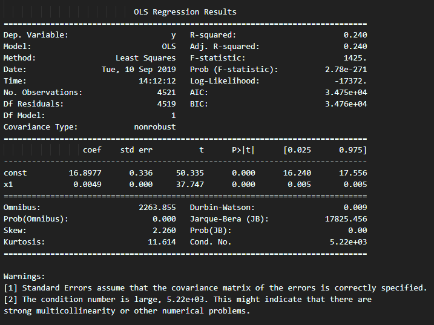

# Financial Applications of Machine Learning

## Assignment 2 - Linear Regression on Stock Data


For this assignment, I have the stock data from this [CSV file](a.us.csv)

### Preview of CSV File

| Date       | Open  | High  | Low   | Close | Volume  | Open Int |
|------------|-------|-------|-------|-------|---------|----------|
| 2000-02-10 | 51.98 | 53.2  | 50.84 | 51.77 | 1130454 | 0        |
| 2000-02-11 | 51.64 | 51.85 | 50.5  | 50.88 | 796545  | 0        |
| 2000-02-14 | 50.8  | 51.94 | 50.5  | 51.6  | 887651  | 0        |
| 2000-02-15 | 51.68 | 56.03 | 51.68 | 55.27 | 2137950 | 0        |
| 2000-02-16 | 54    | 55.27 | 53.59 | 54.68 | 1909225 | 0        |

### Part 1 - Linear Regression using SKLearn

Code is written in [Sklearn_Regression.py](Sklearn_Regression.py)

#### Code

```python
def stock_price_prediction(filePath):
  # Import Libraries
  import numpy as np
  import matplotlib.pyplot as plt
  import pandas as pd

  # Get Data
  dataset = pd.read_csv(filePath)
  X = dataset.iloc[:, 1:-3].values
  y = dataset.iloc[:, -3].values

  # Standardize Feature values
  from sklearn.preprocessing import StandardScaler
  sc_X = StandardScaler()
  X = sc_X.fit_transform(X)

  # Dimensionality reduction
  from sklearn.decomposition import PCA
  pca = PCA(n_components=0.99, whiten=True)
  X = pca.fit_transform(X)

  # Splitting the dataset into training and testing set
  from sklearn.model_selection import train_test_split
  X_train, X_test, y_train, y_test = train_test_split(X, y, test_size=0.3, random_state=0)

  from sklearn.linear_model import LinearRegression
  regressor = LinearRegression()
  regressor.fit(X_train, y_train)

  # Visualizing Training Set results
  plt.scatter(X_train, y_train, color="red")
  plt.plot(X_train, regressor.predict(X_train), color="blue")
  plt.title("Stock Price Prediction (Training Set)")
  plt.xlabel("X")
  plt.ylabel("Price")
  plt.show()

  plt.scatter(X_test, y_test, color="red")
  plt.plot(X_train, regressor.predict(X_train), color="blue")
  plt.title("Stock Price Prediction (Test Set)")
  plt.xlabel("X")
  plt.ylabel("Price")
  plt.show()
```

#### Output

##### Training Set


##### Test Set 


### Part 2 - Linear Regression using StatsModel

Code written in [StatsModel_Regression.py](StatsModel_Regression.py)

#### Code

```python
def stock_price_prediction(filePath):
  import numpy as np
  import pandas as pd
  import matplotlib.pyplot as plt
  import datetime
  import statsmodels.api as sm
  from matplotlib.pyplot import style


  # Set Style for Graphs
  style.use('ggplot')

  # Get Data
  data = pd.read_csv('a.us.csv')
  dates = data.index.tolist()
  prices = data['Close'].tolist()

  dates = sm.add_constant(dates)

  model = sm.OLS(prices, dates).fit()
  predictions = model.predict(dates)

  print_model = model.summary()
  print(print_model)

stock_price_prediction('a.us.csv')
```

#### Output



### Part 3 - Linear Regression using Least Squares method

Code written in [Least_Square.py](Least_Square.py)

#### Code

```python
def stock_price_prediction(filePath):
  # Importing the libraries
  import pandas as pd
  import numpy as np
  import matplotlib.pyplot as plt

  data = pd.read_csv('a.us.csv')
  X = data.iloc[:, 1:-3].values
  y = data.iloc[:, -3].values

  from sklearn.preprocessing import StandardScaler
  sc_X = StandardScaler()
  X = sc_X.fit_transform(X)

  from sklearn.decomposition import PCA
  pca = PCA(n_components=0.99, whiten=True)
  X = pca.fit_transform(X)

  X_mean = np.mean(X)
  Y_mean = np.mean(y)

  num = 0
  den = 0
  for i in range(len(X)):
    num += (X[i] - X_mean) * (y[i] - Y_mean)
    den += (X[i] - X_mean) ** 2
  m = num / den
  c = Y_mean - m*X_mean

  Y_pred = m*X + c
  plt.scatter(X,y)
  plt.plot([min(X), max(X)], [min(Y_pred), max(Y_pred)], color="red")
  plt.show()

stock_price_prediction('a.us.csv')
```

#### Output


